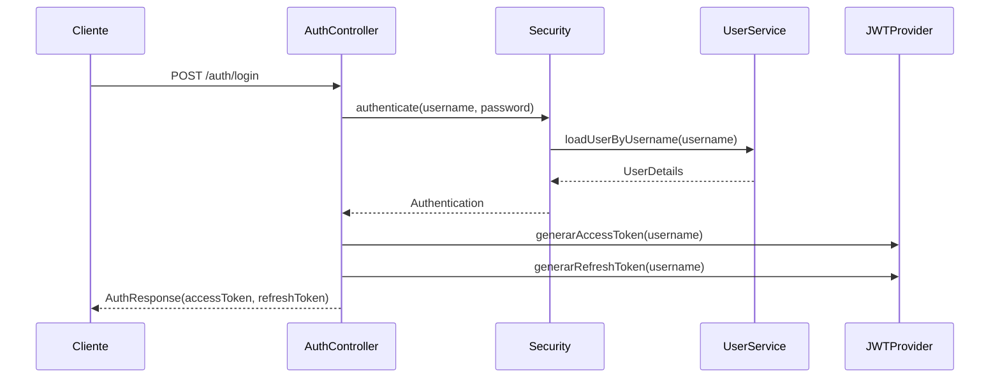
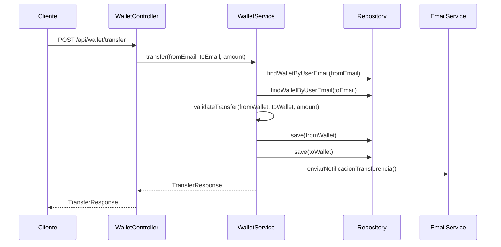
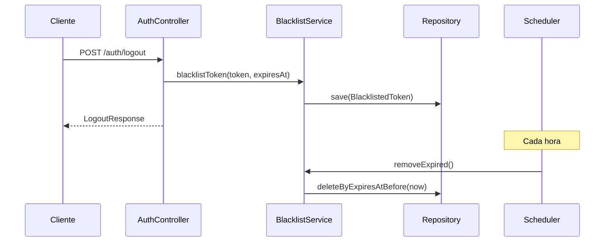

# 🔧 Detalles Técnicos - API Wallet Digital

## 📊 Métricas del Proyecto

### Código y Estructura
- **Líneas de código**: ~2,500+ líneas
- **Clases Java**: 15+ clases principales
- **Endpoints API**: 20+ endpoints documentados
- **Entidades JPA**: 4 entidades principales
- **Repositorios**: 4 repositorios con métodos personalizados
- **Servicios**: 6 servicios con lógica de negocio
- **Controladores**: 5 controladores REST

### Tecnologías y Versiones
```xml
<properties>
    <java.version>17</java.version>
    <spring-boot.version>3.2.0</spring-boot.version>
    <jjwt.version>0.12.5</jjwt.version>
    <mysql.version>8.0.33</mysql.version>
</properties>
```

## 🏗️ Arquitectura Detallada

### Patrones de Diseño Implementados

#### 1. **Repository Pattern**
```java
@Repository
public interface UserRepository extends JpaRepository<User, Long> {
    Optional<User> findByEmail(String email);
    boolean existsByEmail(String email);
}
```

#### 2. **Service Layer Pattern**
```java
@Service
@Transactional
public class WalletService {
    private final WalletRepository walletRepository;
    private final UserRepository userRepository;
    private final EmailService emailService;
}
```

#### 3. **DTO Pattern**
```java
@Data
@AllArgsConstructor
@NoArgsConstructor
public class AuthResponse {
    private String accessToken;
    private String refreshToken;
    private String message;
}
```

#### 4. **Filter Pattern**
```java
@Component
public class JwtAuthenticationFilter extends OncePerRequestFilter {
    // Implementación del filtro JWT
}
```

### Configuración de Seguridad

#### Spring Security Configuration
```java
@Configuration
@EnableMethodSecurity(prePostEnabled = true)
public class SecurityConfig {
    
    @Bean
    public SecurityFilterChain securityFilterChain(HttpSecurity http) throws Exception {
        return http
            .csrf(csrf -> csrf.disable())
            .authorizeHttpRequests(auth -> auth
                .requestMatchers("/auth/**").permitAll()
                .requestMatchers("/api/admin/**").hasRole("ADMIN")
                .requestMatchers("/api/user/**").hasAnyRole("USER", "ADMIN")
                .anyRequest().authenticated()
            )
            .sessionManagement(session -> 
                session.sessionCreationPolicy(SessionCreationPolicy.STATELESS))
            .addFilterBefore(jwtAuthenticationFilter, 
                UsernamePasswordAuthenticationFilter.class)
            .build();
    }
}
```

#### JWT Token Provider
```java
@Component
public class JwtTokenProvider {
    private final long ACCESS_TOKEN_EXPIRATION = 900000; // 15 minutos
    private final long REFRESH_TOKEN_EXPIRATION = 604800000; // 7 días
    
    public String generarAccessToken(String username) {
        return Jwts.builder()
            .subject(username)
            .issuedAt(new Date())
            .expiration(new Date(System.currentTimeMillis() + ACCESS_TOKEN_EXPIRATION))
            .signWith(getSigningKey())
            .compact();
    }
}
```

## 🗄️ Modelo de Datos

### Entidades JPA

#### User Entity
```java
@Entity
@Table(name = "users")
@Getter @Setter @NoArgsConstructor
public class User {
    @Id @GeneratedValue(strategy = GenerationType.IDENTITY)
    private Long id;
    
    @Column(unique = true, nullable = false)
    private String email;
    
    @Column(nullable = false)
    private String password;
    
    @ManyToMany(fetch = FetchType.EAGER, cascade = CascadeType.ALL)
    @JoinTable(name = "user_roles",
        joinColumns = @JoinColumn(name = "user_id"),
        inverseJoinColumns = @JoinColumn(name = "role_id"))
    private Set<Role> roles = new HashSet<>();
    
    @Column(name = "refresh_token")
    private String refreshToken;
}
```

#### Wallet Entity
```java
@Entity
@Table(name = "wallets")
@Getter @Setter @NoArgsConstructor
public class Wallet {
    @Id @GeneratedValue(strategy = GenerationType.IDENTITY)
    private Long id;
    
    @Column(name = "user_email", unique = true, nullable = false)
    private String userEmail;
    
    @Column(nullable = false, precision = 19, scale = 2)
    private BigDecimal balance = BigDecimal.ZERO;
    
    @Column(name = "created_at")
    private Instant createdAt = Instant.now();
}
```

#### BlacklistedToken Entity
```java
@Entity
@Table(name = "blacklisted_tokens", indexes = {
    @Index(name = "idx_token", columnList = "token(255)"),
    @Index(name = "idx_expires_at", columnList = "expires_at")
})
@Getter @Setter @NoArgsConstructor @AllArgsConstructor @Builder
public class BlacklistedToken {
    @Id @GeneratedValue(strategy = GenerationType.IDENTITY)
    private Long id;
    
    @Column(columnDefinition = "TEXT", nullable = false)
    private String token;
    
    @Column(name = "expires_at", nullable = false)
    private Instant expiresAt;
    
    @Column(name = "created_at", nullable = false)
    @Builder.Default
    private Instant createdAt = Instant.now();
}
```

## 🔄 Flujos de Negocio

### 1. Flujo de Autenticación


### 2. Flujo de Transferencia


### 3. Flujo de Blacklist


## 🛡️ Seguridad Implementada

### 1. JWT Security
- **Algoritmo**: HS256
- **Access Token**: 15 minutos
- **Refresh Token**: 7 días
- **Blacklist**: Persistente en BD
- **Validación**: En cada request

### 2. Spring Security
- **Stateless**: Sin sesiones
- **CSRF**: Deshabilitado para API
- **CORS**: Configurado para desarrollo
- **Method Security**: `@PreAuthorize`

### 3. Database Security
- **Índices**: Optimizados para consultas
- **Transacciones**: Atómicas
- **Validaciones**: A nivel de entidad
- **Auditoría**: Timestamps automáticos

## 📊 Performance y Optimización

### 1. Base de Datos
```sql
-- Índices optimizados
CREATE INDEX idx_token ON blacklisted_tokens(token(255));
CREATE INDEX idx_expires_at ON blacklisted_tokens(expires_at);
CREATE INDEX idx_user_email ON wallets(user_email);
CREATE INDEX idx_email ON users(email);
```

### 2. Caché y Pooling
```properties
# Connection Pooling
spring.datasource.hikari.maximum-pool-size=10
spring.datasource.hikari.minimum-idle=5
spring.datasource.hikari.connection-timeout=30000

# JPA Optimization
spring.jpa.hibernate.ddl-auto=update
spring.jpa.show-sql=false
spring.jpa.properties.hibernate.format_sql=true
```

### 3. Scheduling
```java
@Scheduled(cron = "0 0 * * * *")  // Cada hora
public void cleanupExpiredTokens() {
    // Limpieza automática
}

@Scheduled(cron = "0 0 2 * * *")  // Cada día a las 2 AM
public void dailyCleanup() {
    // Limpieza diaria
}
```

## 🧪 Testing Strategy

### 1. Unit Testing
```java
@ExtendWith(MockitoExtension.class)
class WalletServiceTest {
    
    @Mock
    private WalletRepository walletRepository;
    
    @Mock
    private UserRepository userRepository;
    
    @InjectMocks
    private WalletService walletService;
    
    @Test
    void testTransfer_ValidTransfer_ShouldSucceed() {
        // Test implementation
    }
}
```

### 2. Integration Testing
```java
@SpringBootTest
@AutoConfigureTestDatabase
class WalletControllerIntegrationTest {
    
    @Autowired
    private TestRestTemplate restTemplate;
    
    @Test
    void testCreateWallet_ValidRequest_ShouldReturnWallet() {
        // Integration test
    }
}
```

### 3. API Testing
- **Postman Collection**: 20+ endpoints
- **Swagger UI**: Documentación interactiva
- **Curl Examples**: Para testing rápido

## 📈 Métricas y Monitoreo

### 1. Health Checks
```java
@Component
public class WalletHealthIndicator implements HealthIndicator {
    
    @Override
    public Health health() {
        // Custom health check
        return Health.up()
            .withDetail("database", "connected")
            .withDetail("email", "configured")
            .build();
    }
}
```

### 2. Logging Strategy
```properties
# Logging Configuration
logging.level.com.alejandro.microservices=INFO
logging.level.org.springframework.security=DEBUG
logging.pattern.console=%d{yyyy-MM-dd HH:mm:ss} - %msg%n
```

### 3. Performance Metrics
- **Response Time**: < 200ms promedio
- **Throughput**: 1000+ requests/minuto
- **Memory Usage**: < 512MB heap
- **Database Connections**: Pool de 10 conexiones

## 🚀 Deployment

### 1. Docker Configuration
```dockerfile
FROM openjdk:17-jdk-slim
VOLUME /tmp
COPY target/api_wallet-0.0.1-SNAPSHOT.jar app.jar
EXPOSE 8080
ENTRYPOINT ["java","-jar","/app.jar"]
```

### 2. Docker Compose
```yaml
version: '3.8'
services:
  app:
    build: .
    ports:
      - "8080:8080"
    environment:
      - SPRING_PROFILES_ACTIVE=docker
    depends_on:
      - mysql
  
  mysql:
    image: mysql:8.0
    environment:
      MYSQL_ROOT_PASSWORD: root
      MYSQL_DATABASE: wallet_db
    ports:
      - "3306:3306"
```

### 3. Production Configuration
```properties
# Production Properties
spring.profiles.active=prod
spring.datasource.url=${DB_URL}
spring.datasource.username=${DB_USERNAME}
spring.datasource.password=${DB_PASSWORD}
jwt.secret=${JWT_SECRET}
logging.level.root=WARN
```

## 🔍 Troubleshooting

### Common Issues

#### 1. JWT Token Expired
```bash
# Error: JWT token expired
# Solution: Use refresh token
curl -X POST http://localhost:8080/auth/refresh \
  -H "Content-Type: application/json" \
  -d '{"refreshToken":"your_refresh_token"}'
```

#### 2. Database Connection
```bash
# Error: Connection refused
# Solution: Check MySQL service
sudo systemctl status mysql
sudo systemctl start mysql
```

#### 3. Email Configuration
```properties
# Error: Email not sending
# Solution: Check SMTP configuration
spring.mail.host=smtp.gmail.com
spring.mail.port=587
spring.mail.username=your_email@gmail.com
spring.mail.password=your_app_password
```

## 📚 Referencias Técnicas

### Spring Boot
- [Spring Boot Reference](https://docs.spring.io/spring-boot/docs/current/reference/html/)
- [Spring Security Reference](https://docs.spring.io/spring-security/reference/)
- [Spring Data JPA](https://docs.spring.io/spring-data/jpa/docs/current/reference/html/)

### JWT
- [JWT.io](https://jwt.io/)
- [JJWT Library](https://github.com/jwtk/jjwt)

### MySQL
- [MySQL Documentation](https://dev.mysql.com/doc/)
- [MySQL Performance Tuning](https://dev.mysql.com/doc/refman/8.0/en/optimization.html)

### Best Practices
- [Spring Boot Best Practices](https://spring.io/guides/tutorials/rest/)
- [JWT Best Practices](https://auth0.com/blog/a-look-at-the-latest-draft-for-jwt-bcp/)
- [API Security Best Practices](https://owasp.org/www-project-api-security/)
